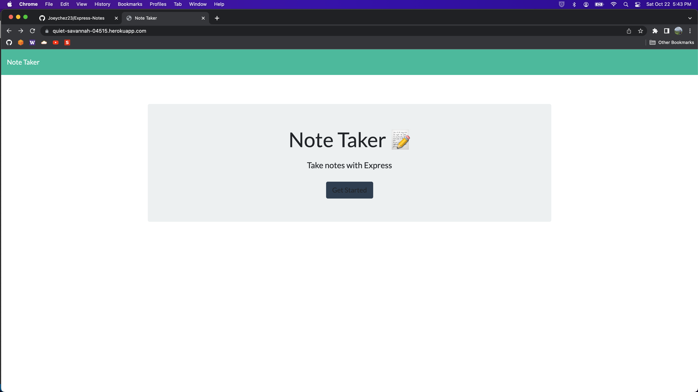
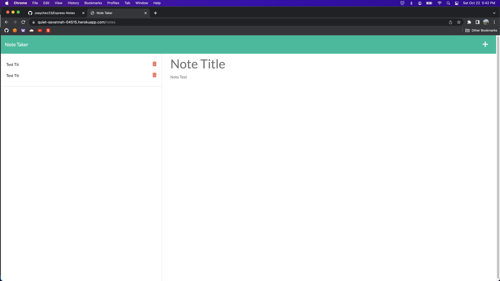

# Express-notes

## Table of Contents:

[1. Description](#Description)  
[2. Installation](#Installation)  
[3. Usage](#Usage)  
[4. Output](#Output)  
[5. Contributors](#Contributors)  
[6. Questions](#Questions)

## Description

Using Node.js a server is provisioned so values can be saved to a file as long a the server runs

## Installation

1. clone the repo
2. cd into the directory
3. run npm i inside the terminal

## Usage

1. run "npm start" or "node index.js" in terminal to begin
2. Load "index.html" on localhost port 3000

## Output

Link: https://quiet-savannah-04515.herokuapp.com/

## Contributors

Joeychez23

## Questions

Email: joeychez123@gmail.com

Github: https://github.com/Joeychez23

Repo: https://github.com/Joeychez23/Express-Notes

Link: https://quiet-savannah-04515.herokuapp.com/
